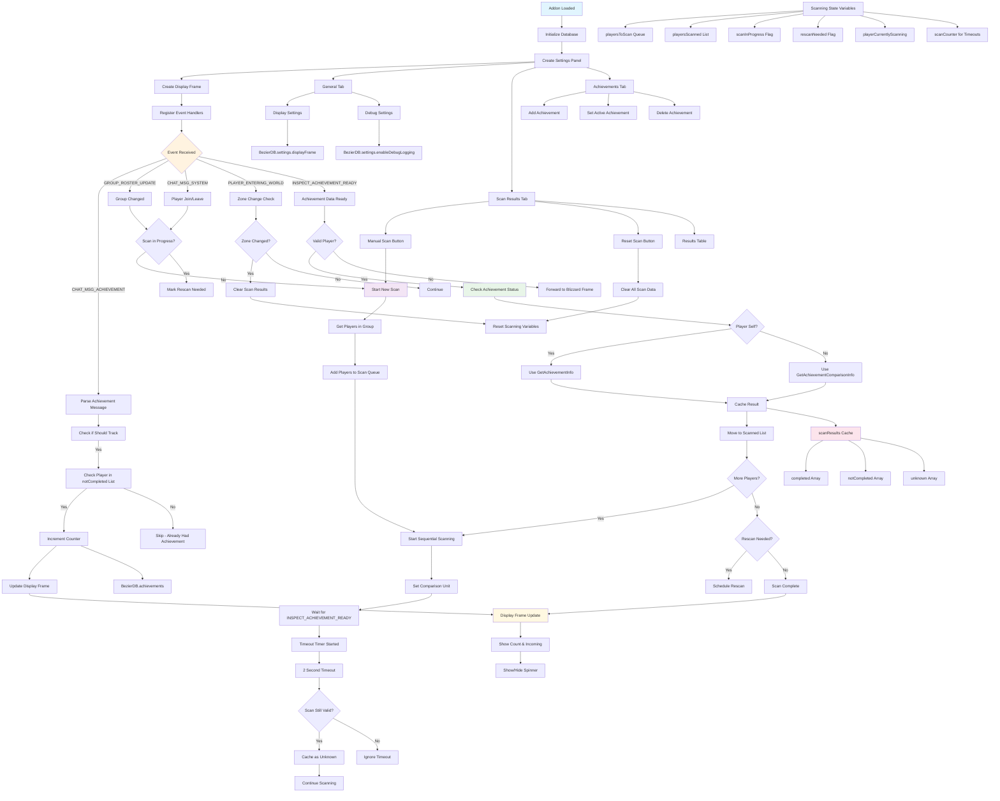

# Bezier Addon Architecture

## Overview

The Bezier addon is a World of Warcraft achievement tracking system that monitors first-time achievement completions within groups. It uses an event-driven architecture with sequential achievement scanning to provide real-time tracking of achievement progress.

## Architecture Diagram



## Core Architecture

### Event-Driven System
The addon responds to key WoW events:
- `CHAT_MSG_ACHIEVEMENT`: Achievement announcements in chat
- `GROUP_ROSTER_UPDATE`: Group composition changes
- `CHAT_MSG_SYSTEM`: Player join/leave messages
- `PLAYER_ENTERING_WORLD`: Zone transitions and login
- `INSPECT_ACHIEVEMENT_READY`: Achievement inspection data ready

### Sequential Achievement Scanning
Uses WoW's inspection API to check achievement completion status:
- Queue-based processing (`playersToScan` → `playersScanned`)
- One player scanned at a time to avoid API conflicts
- Timeout handling for cross-realm/offline players
- Automatic rescanning when group changes during scan

### Smart Caching System
Maintains scan results to optimize performance:
- `scanResults[achievementID]` contains completion status arrays
- Three categories: `completed`, `notCompleted`, `unknown`
- Zone-aware cache clearing when changing instances
- Persistent across group changes within same zone

### Conservative Counting Logic
Only increments counters for confirmed first-time achievements:
- Validates against cached `notCompleted` list before counting
- Skips players with unknown or already-completed status
- Prevents double-counting from uncertain scan results

## Key Components

### Scanning Engine
**State Variables:**
- `playersToScan`: Queue of players awaiting scan
- `playersScanned`: List of successfully scanned players
- `scanInProgress`: Global scan lock prevents concurrent scans
- `rescanNeeded`: Flags need for rescan after current completes
- `playerCurrentlyScanning`: Current target unit
- `scanCounter`: Invalidates stale timeout timers

**Process Flow:**
1. Group change triggers scan initiation
2. Players added to scan queue
3. Sequential inspection using `SetAchievementComparisonUnit`
4. 2-second timeout per player with fallback to "unknown"
5. Results cached and UI updated

### Achievement Tracking
**Message Parsing:**
- Extracts achievement ID from chat link format
- Validates achievement exists and should be tracked
- Normalizes player names (strips realm suffixes)

**Counting Logic:**
- Checks if player was in `notCompleted` list from scan
- Only increments counter for confirmed first-time completions
- Updates display frame for active achievement

### UI Components

#### Display Frame
- **Line 1**: Total achievement count with configurable prefix
- **Line 2**: Incoming potential achievements (group members without achievement)
- **Spinner**: Shows during active scanning or when unknown players exist
- **Auto-resize**: Adjusts to content and font size
- **Movable**: Shift+drag to reposition

#### Settings Panel (3 Tabs)
1. **General**: Display settings, font size, debug mode
2. **Scan Results**: Manual scan controls, results table
3. **Achievements**: Add/remove tracked achievements, set active

### Data Management

#### Persistent Storage (`BezierDB`)
```lua
{
    achievements = {
        [achievementID] = count  -- Simple counter per achievement
    },
    settings = {
        activeAchievementID = number,
        displayFrame = { ... },
        enableDebugLogging = boolean
    }
}
```

#### Runtime Cache (`scanResults`)
```lua
{
    [achievementID] = {
        completed = {},      -- Players who have achievement
        notCompleted = {},   -- Players who don't have achievement
        unknown = {},        -- Cross-realm/timeout players
        timestamp = time,
        zone = string
    }
}
```

## Critical Control Flows

### 1. Group Change Detection
```
Group Change Event → Check Scan Status → Start/Schedule Scan → Update Display
```

### 2. Achievement Scanning
```
Get Players → Queue Players → Sequential Scan → Cache Results → Update UI
├── Success: Move to scanned list, continue
├── Timeout: Cache as unknown, continue
└── Complete: Check for rescan need
```

### 3. Achievement Earned
```
Chat Message → Parse Achievement → Validate Tracking → Check Cache → Count/Skip → Update
```

### 4. Zone Transition
```
Zone Change → Clear Cache → Reset Scan State → Trigger New Scan (if in group)
```

## Design Principles

### Robustness
- Timeout handling for unresponsive players
- State validation with scan counters
- Graceful handling of API limitations

### Accuracy
- Conservative counting prevents false positives
- Cache validation before incrementing counters
- Zone-aware cache management

### Performance
- Sequential scanning prevents API conflicts
- Efficient caching reduces redundant scans
- Minimal UI updates during scanning

### User Experience
- Real-time visual feedback with spinner
- Configurable display text and formatting
- Comprehensive settings interface

## Limitations

1. **Cross-realm Scanning**: Limited by WoW's inspection API
2. **Range Requirements**: Players must be in inspection range
3. **Sequential Processing**: One player at a time scanning
4. **Achievement Frame Conflicts**: Temporarily disables Blizzard's comparison frame

## Future Considerations

- Batch scanning improvements
- Enhanced cross-realm support
- Additional achievement categories
- Performance optimizations for large raids
